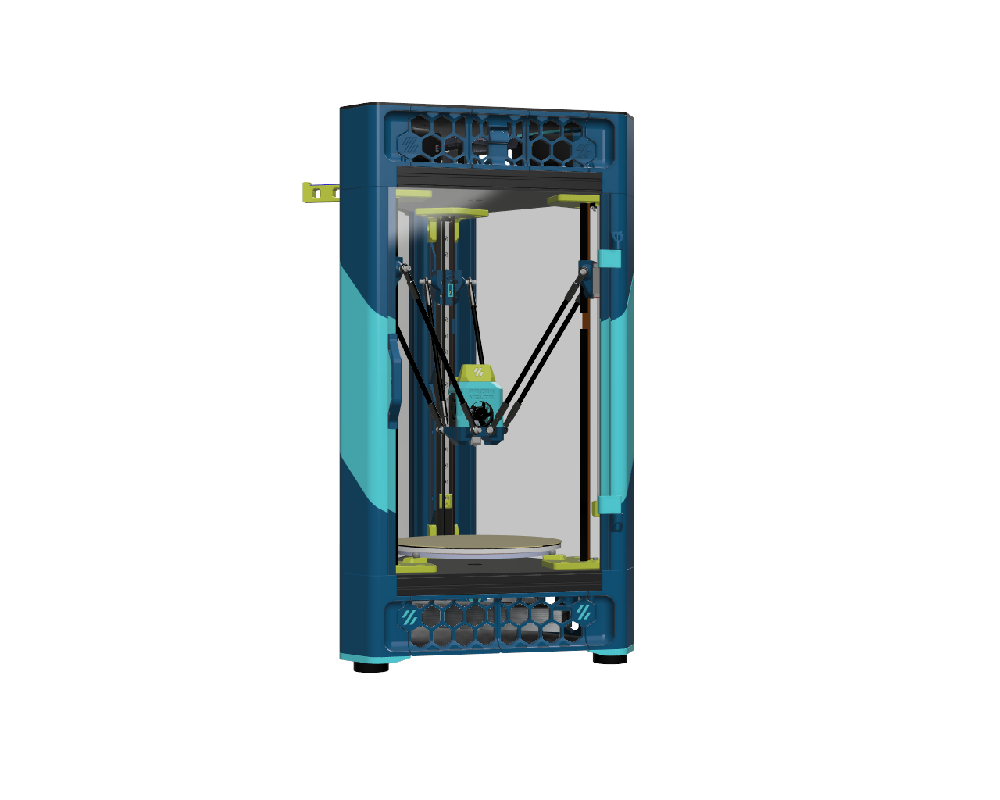
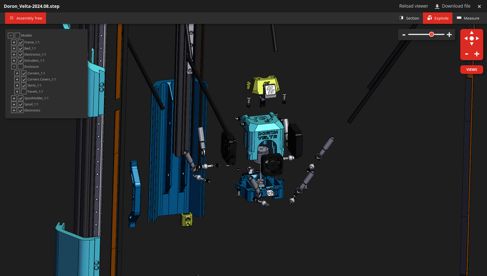
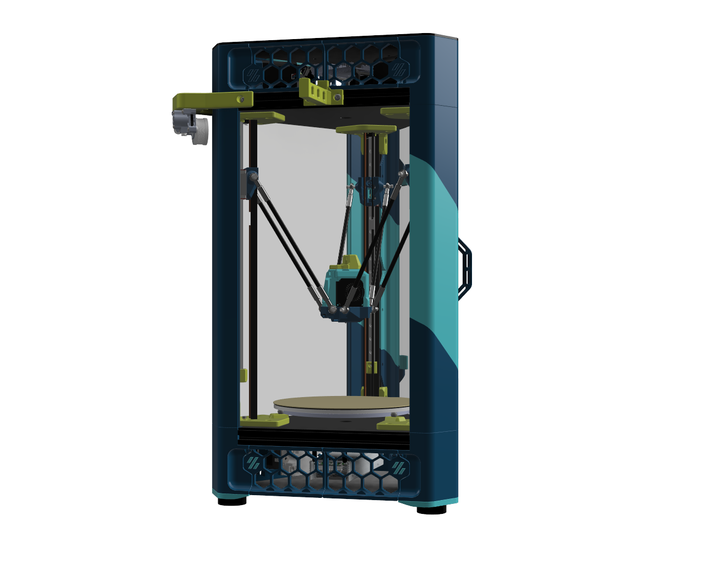
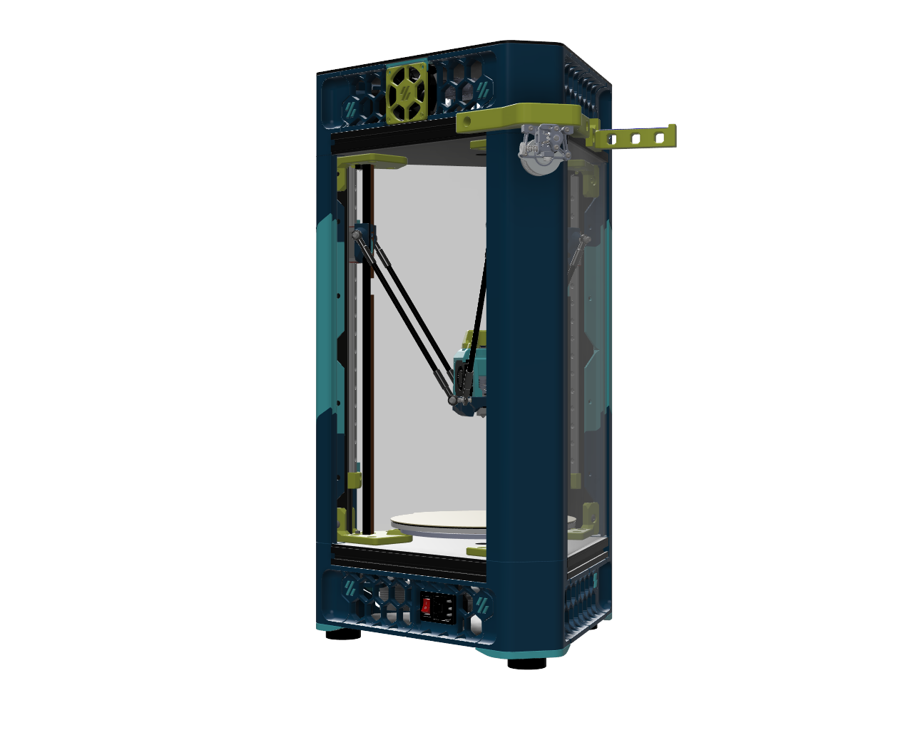
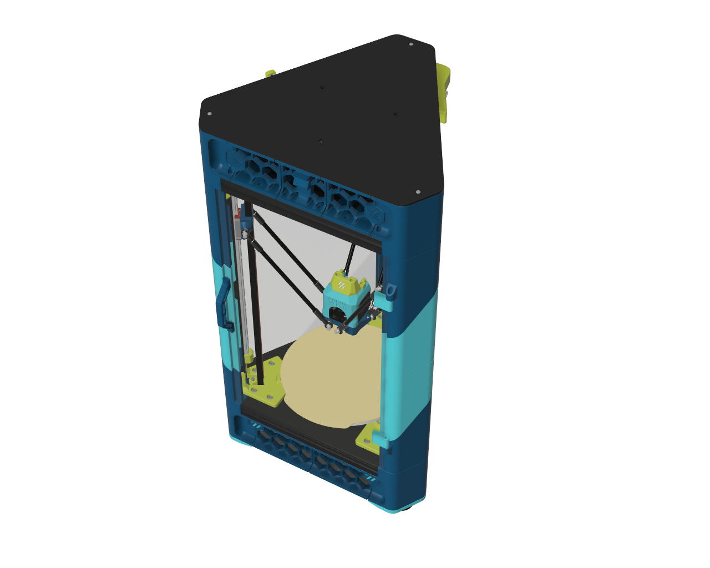

# Doron Velta

This is [Rogerio Goncalves' fantastic Doron Velta project](https://github.com/rogerlz/Doron-Velta) by Fabreeko and HoneyBadger.

[Our kits are available to purchase here](https://www.fabreeko.com/products/doron-velta-delta-style-3d-printer-kit?_ref=github).

And our community members have published the following.

## What's here?

- Getting started
- Viewing the CAD online
- Installing Firmware
- Getting Help
- Links to community sources for additional improvements, mods, and fixes.

We also have published a complete set of STLs, CAD, and everything you need to print and build our Doron Velta kits, including:

  - All STLs have been fixed, renamed, and **are properly oriented for printing!**
  - Standard Voron naming conventions, accents, etc are now used.
  - Optional 3rd color in CAD and STLs. If you only want one accent color treat both [a1] and [a2] as the same color.

### Before you Begin

Please consider [joining our Discord server for live community support](https://discord.gg/Fabreeko).  We also provide customer support through the same Discord.

### Getting started

- Download this repository's zip file for all the STLs and 3mf files to print.
- Assemble following the CAD (see below).
- Following the wiring guide located in this repository (currently Fystec's version).
- Install [our Firmware](/Firmware).

### View the CAD online

To help during assembly, you may need to refer to the CAD.  An online version is available here:

https://grabcad.com/library/doron-velta-r2-by-fabreeko-1

Once there, click the "Load in 3D Viewer", to view it.

### Installing Firmware

[Please see the /Firmware folder](/Firmware).

## Renders

## Community Links

- Rogerio Goncalves' official release of the DV: https://github.com/rogerlz/Doron-Velta
- Fystec R2 Edition: https://github.com/FYSETC/FYSETC-Doron_Velta
- Grab CAD Live 3D Viewer: https://grabcad.com/library/doron-velta-r2-by-fabreeko-1

## Licenses

- Licensed under GPL-3.0.
- At the time of writing, Fystec has not provided a license but is assumed to allow distribtion.
