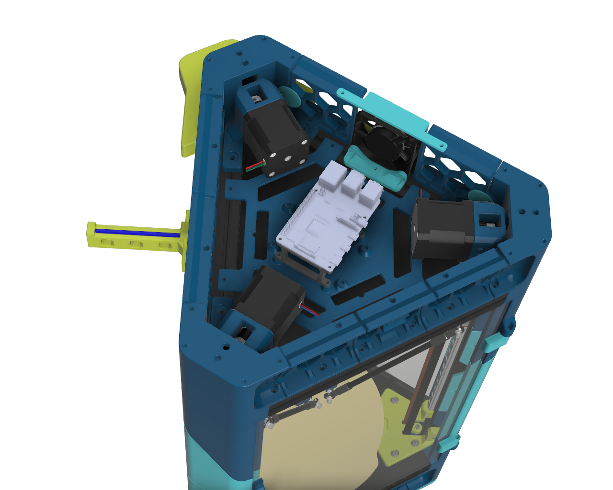

# Doron Velta

This is Fabreeko's repository of Rogerio Goncalves' fantastic Doron Velta project (https://github.com/rogerlz/Doron-Velta).  Here you will find our staff and community member's efforts to organize, improve upon, and support the project.

## What's here?

- Getting started guides
- Complete STLs, CAD, and everything you need to print and build our Doron Velta kits.
  - **All STLs have been fixed, renamed, and are properly oriented for printing!**
  - Standard Voron naming conventions, accents, etc are now used.
  - Optional 3rd color in CAD and STLs. If you only want one accent color treat both [a1] and [a2] as the same color.
- Links to popular community sources for additional improvements, mods, and fixes.

## Getting started

- Download and fimiliarize yourself with the published manuals.
  - Fystec has published a Wiring Guide as well as an Introduction and Safety pamplet: https://github.com/FYSETC/FYSETC-Doron_Velta
- Download the repository's zip file, extract, and print the parts.
- Assemble following the CAD.

## View the CAD Online

To help during assembly, you may need to refer to the CAD.  An online version is available here:

https://grabcad.com/library/doron-velta-r2-by-fabreeko-1

Once there, click the "Load in 3D Viewer", to view it.

## Community Links

- Rogerio Goncalves' official release of the DV: https://github.com/rogerlz/Doron-Velta
- Fystec R2 Edition: https://github.com/FYSETC/FYSETC-Doron_Velta
- GrabCAD Live 3D Viewer: https://grabcad.com/library/doron-velta-r2-by-fabreeko-1

## Renders

## Licenses

- Licensed under GPL-3.0.
- Fystec does not provide a license.
